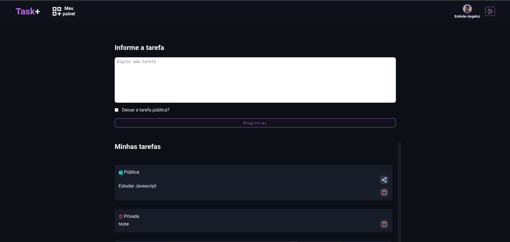

# Project TASK+

<div align="center" >
	
</div>

#### Desenvolvi esse projeto voltado para a organização de tarefas, utilizando o framework Next.js e o Firestore do Firebase. O login é simplificado, permitindo o acesso através da conta do Google, o que torna o cadastro de usuários mais fácil. Trata-se de um sistema simples, porém prático para o dia a dia. 

### Tela Home
<div align="center">
	
</div>

### Tela Dashboard
<div align="center">
	
</div>

### Tela Dashboard
<div align="center">
	
</div>

### Tela Detalhes da tarefa
<div align="center">
	
</div>

### Tela Detalhes da tarefa com comentário do usuário
<div align="center">
	
</div>

## Início

Para começar, execute o servidor de desenvolvimento:

```bash
npm run dev
# ou
yarn dev
```

Abra [http://localhost:3000](http://localhost:3000) no seu navegador para ver o resultado.

## Saiba Mais

Para aprender mais sobre o Next.js, dê uma olhada nos seguintes recursos:

- [Next.js Documentation](https://nextjs.org/docs) - aprenda sobre os recursos e a API do Next.js.
- [Learn Next.js](https://nextjs.org/learn) - um tutorial interativo do Next.js.

Você pode conferir [the Next.js GitHub repository](https://github.com/vercel/next.js/) - seu feedback e contribuições são bem-vindos!


## Implante no Vercel

A maneira mais fácil de implantar seu aplicativo Next.js é usar a  [Vercel Platform](https://vercel.com/new?utm_medium=default-template&filter=next.js&utm_source=create-next-app&utm_campaign=create-next-app-readme) dos criadores do Next.js.


Confira nossa [Next.js deployment documentation](https://nextjs.org/docs/deployment) para mais detalhes.

# TaskPlus
